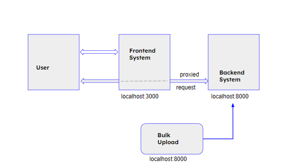

# Weather App
A web application that allows to upload climate data and query with details of Date and Time...
The application is implemented with **Python** and 
**Django** on the backend side and **ReactJS** on the front end
side. **SQLite** is used as a database.

### Setup and Configuration
```
git clone https://github.com/ramganez/weather_app.git
cd weather_app

# Backend setup (Python 3.8.10)
cd backend
virtualenv w_env
source w_env/bin/activate
pip install -r requirements.txt
python manage.py migrate

# Frontend setup (Node v16.17.0 and npm v8.15.0)
cd frontend
npm install
```

### Upload weather data 
* Download "Climate Hourly" data from - https://winnipeg.weatherstats.ca/download.html
* Upload csv file in localhost:8000 (backend portal)

### Query weather data 
* Open frontend system (localhost:3000)
* Select Date to get weekly forecast with different time
* Select Date & Time to get weekly forecast for chosen time

### Overview 
* Backend web portal will allow uploading bulk climate data
* We can update the system data with upload a new data file
* In the frontend system, we can specify the date & time to see the climate data. 

### Overview 
* Currently system support specific fields like,
  - Temperature
  - Humidity
  - Wind Direction
  - Wind Speed
  we can include more fields, it is configurable.
  
* Currently, data is displayed in table format in the future we can keep more data with a collapsible table.



